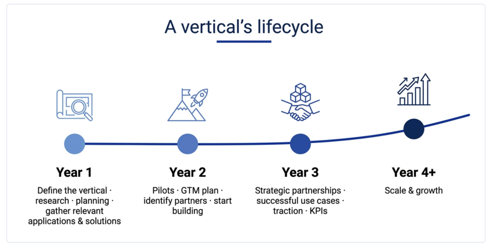

## **A Vertical Approach for Cardano — Vertical-to-KPI Impact Framework**

**Executive Summary:** This document consolidates and synthesises the official Cardano 2030 KPI definitions into a single authoritative reference, and audits how vertical work is currently selected, owned, coordinated, and reported across the ecosystem establishing the specific problems the Vertical-to-KPI Impact Framework must solve.

**Project:** A Vertical Approach for Cardano — Vertical-to-KPI Impact Framework  
**Author:** Benjamin Ben Zvi - ELK GmBh  
**Document Type:** Phase 1 Foundational Research (Covers Proposal Tasks P1-1 and P1-2)  
**Release Date:** August 2026

# **Table of Contents:**

**1. Introduction**  
1.1 What this Project is  
1.2 What Phase 1 Delivers  
1.3 How to Read this Document

**2\. Guiding Principle and Scope**

**3\. Cardano 2030 KPI Synthesis (P1-1)**  
3.1 A Note on Terminology  
3.2 Core Adoption KPIs (the "North Star")  
3.3 Additional Primary KPIs  
3.4 Project-Defined Extensions  
3.5 Synthesis Takeaway

**4\. Current State of Ecosystem BD & Coordination**  
4.1 The Core Finding  
4.2 Who Does What Today  
4.3 Why this Produces Friction  
4.4 Concrete Evidence of Missed Opportunities

**5\. Audit of Existing Vertical Reporting (P1-2)**  
5.1 What "Reporting" Looks Like Today  
5.2 The Four Reporting Failures  
5.3 Audit Conclusion

**6\. Synthesis: What the Framework Must Solve**

**7\. Reusable Assets Inherited by this Project**

# **1\. Introduction**

## **1.1 What this Project is**

Cardano does not have a shortage of business development (BD) activity. It has a shortage of  
coordinated business development. Across the ecosystem, multiple well-resourced entities, the Cardano Foundation, Intersect, IOG, EMURGO, Project Catalyst, and a long tail of independent projects, are all pursuing market adoption in parallel, with different mandates, different geographies, different funding models, and no shared framework connecting their work to a common set of outcomes.

The consequence is that the ecosystem cannot currently answer a simple question: "Is any given strategy actually moving Cardano toward its 2030 goals?" Investments are evaluated without a projected KPI impact, cross-vertical comparisons are inconsistent or impossible, and neither the community nor DReps have the data infrastructure to assess whether coordinated effort in a given industry is worth funding.

This project exists to close that gap. Its purpose is to design, validate, and publish a replicable Vertical-to-KPI Impact Framework, a flexible methodology that measures how real-world actions by end users and operators translate into on-chain events, and how those events contribute to Cardano's 2030 North Star KPIs. The framework is then stress-tested by applying it to three deliberately different pilot verticals: Agriculture, Bitcoin DeFi, and Governance.

A defining principle of the approach is that each vertical is analysed industry-first. For every vertical we begin by understanding the real-world industry outside of Cardano, its participants, its structural problems, and why those problems persist, and only then examine how the Cardano ecosystem, acting in a coordinated way, can credibly solve them. Blockchain is treated as a means to solve genuine market problems, never as a solution in search of one.

## **1.2 What Phase 1 Delivers**

Phase 1 establishes the evidence base and the analytical foundations the framework is built on. Per the funded proposal, Phase 1 comprises four deliverables:

1\. Review and synthesise all existing Cardano 2030 KPI definitions (covered in this document \- Section 3).  
2\. Audit existing vertical reporting approaches across Cardano ecosystem teams (covered in this document \- Sections 4–6).  
3\. Benchmark methodologies from adjacent ecosystems (Polkadot, Ethereum ecosystem funds, Cosmos) to identify best practices (separate document \- P1-3).  
4\. Draft the initial Impact Vertical Template and scenario modeling structure (separate  
document \- P1-4).

This document delivers the first two. It consolidates and synthesises the official Cardano 2030 KPI definitions into a single authoritative reference, and it audits how vertical work is currently selected, owned, coordinated, and reported across the ecosystem, establishing the specific problems the Vertical-to-KPI Impact Framework must solve. It also incorporates the base diagnostic research on the current state of ecosystem BD, the coordination gaps, and how a vertical-led approach addresses them, so that everything downstream builds on a single, consistent foundation.

## **1.3 How to Read this Document**

**Section 2** sets out the guiding principle and scope.  
**Section 3** is the KPI synthesis (Proposal Task P1-1): the authoritative, consolidated set of Cardano 2030 KPIs and their definitions.  
**Section 4** describes the current state of ecosystem BD and coordination, who does what today.  
**Section 5** is the reporting audit proper (Proposal Task P1-2): how vertical progress is currently  
measured and reported, and where that breaks down.  
**Section 6** synthesises the gaps and states what the vertical framework must therefore solve.  
**Section 7** lists the reusable assets this project inherits rather than reinvents.

# **2\. Guiding Principle and Scope**

A large amount of relevant strategy, KPI definition, and market research already exists across the ecosystem; the problem is that it is fragmented, inconsistently framed, and disconnected from measurable outcomes. Phase 1 therefore prioritises assembling what exists, identifying what genuinely does not, and establishing a shared analytical language, rather than generating new frameworks on top of unexamined ground.

**In scope for this document:** the authoritative 2030 KPI set; the current-state map of who conducts and funds vertical/BD activity; how vertical progress is (and is not) reported today; and the resulting gaps the framework must address.

# **3\. Cardano 2030 KPI Synthesis (Proposal Task P1-1)**

This section consolidates the official Cardano 2030 KPI definitions into a single reference, drawn from the Intersect Product Committee's Cardano 2030 Strategic Framework. The framework is explicit that this KPI set is not final, it is expected to mature through 2026 with additional secondary and tertiary indicators, and with dedicated marketing KPIs still to be developed.

## **3.1 A Note on Terminology**

The strategy distinguishes two terms that this project uses consistently:

- **Metrics** are quantifiable measures of ecosystem activity (transaction counts, wallet addresses, fee volumes). They answer "What is happening?"  
- **Key Performance Indicators (KPIs)** are the curated subset of metrics that directly measure progress toward strategic objectives. They answer "Are we succeeding?" KPIs are deliberately limited in number to preserve strategic focus.

## **3.2 Core Adoption KPIs (the "North Star")**

Three headline KPIs measure Cardano's usage, adoption, and sustainability. Progress across all three signals genuine product-market fit.

| Area | KPI | Current Status | 2030 Target | Definition / How Measured | Rationale |
| ----- | ----- | ----- | ----- | ----- | ----- |
| Adoption | Total Value Locked (TVL) | ~$200M | $3B | Sum of locked assets, with liquid-staking normalisation | Capital-confidence indicator |
| Adoption | Monthly Transactions | \~800k/month | ≥27M/month | Submitted transactions per month (≈324M/year at target) | Signals broad, recurring on-chain activity |
| Adoption | Monthly Active Users (MAU) | \~100k–300k/month | 1M | Unique addresses with ≥1 transaction over a 30-day window | Measures active participation and engagement |

## **3.3 Additional Primary KPIs**

The strategy adds a set of supporting primary KPIs across reliability, governance, operations, revenue, and scalability.

| Area | KPI | Current Status | 2030 Target | Rationale |
| ----- | ----- | ----- | ----- | ----- |
| Reliability | Monthly uptime | 99.98% | 99.98% (no blockless interval ≥5 min across 6 epochs) | Best-in-class operational reliability |
| Operational Resilience | Voting-power distribution of controlling stake | 35 DReps | 50% + 1 lovelace effective voting power controlled by \>22 DReps | Mitigates risk of collusion / plutocratic capture |
| Operational Resilience | Alternative full-node clients | 1 | ≥2 live, spec-conformant | Reduces single-client risk |
| Revenue / Adoption | Annual protocol revenue | 3.5M ADA/year | ≥16M ADA/year (assumes ADA ≈ $5 and avg fee falling from 0.3 → 0.05 ADA) | Key metric of economic self-sufficiency |
| Governance | DRep participation rate | — | \>70% of active DReps (by stake) vote on ≥90% of governance actions | Measures vitality of the decision-making layer |
| Scalability | Throughput capacity | \~300k tx/day | 3× current capacity | Tracks scalability to meet adoption KPIs |

## **3.4 Project-Defined Extensions (Currently Undefined)**

The proposal and prior consolidation work reference three additional metric areas:

- An **External Perception Index (EPI)**  
- **Real-World Product/Partnership (RWPP) metrics**  
- **B2B partnership metrics**

These are recognised as strategically relevant, the Governance vertical in particular leans on external perception, but they currently lack explicit definitions, owners, and data sources. Any vertical application that intends to cite them must first propose a working definition and a data source, or it will hit the same measurement wall. This is flagged here so it is addressed deliberately rather than discovered late.

## **3.5 Synthesis Takeaway**

The 2030 KPI set is coherent, officially ratified, and stable enough to build on, the three North Star KPIs plus the primary supporting set form a solid measurement backbone. The two practical cautions for this project are: (1) express each KPI consistently (one figure, one timescale, sourced verbatim from the strategy), and (2) treat EPI/RWPP/B2B as to-be-defined rather than as ready inputs.

# **4\. Current State of Ecosystem Business Development and Coordination**

This section maps who actually conducts and funds vertical/BD activity today. It is the necessary  
backdrop to the reporting audit in Section 5: you cannot assess how vertical work is reported without first establishing who is doing it.

## **4.1 The Core Finding**

Cardano's problem is **uncoordinated BD, not absent BD.** Effort is distributed across at least five actors with disparate mandates, geographies, and funding models, pursuing overlapping goals in parallel with no connective framework and no single point of reconciliation.

## **4.2 Who Does What Today**

| Actor | Role in Vertical / BD Activity | Character of the Effort |
| ----- | ----- | ----- |
| Cardano Foundation | Venture Hub, Enterprise Enablement Program, RWA/DeFi initiatives, UNDP partnership | The most structured actor, but bounded by its own scope and mandate |
| Intersect | Convenes committees, defines outcomes, coordinates | A coordination layer that explicitly disclaims ownership of BD delivery |
| Project Catalyst | Community-vote-driven funding (e.g., Fund 13: R&D and Growth & Acceleration streams) | Episodic and vote-driven rather than a continuous pipeline |
| EMURGO | Previously partner-driven commercialisation | Has stepped back from active BD |
| IOG | BD teams promoting IOG products and Cardano overall | Product-driven outreach aligned to IOG’s commercial roadmap |
| Community | Grassroots outreach: Largely unfunded, coordination efforts through CBDAO and community partnerships | Largely unfunded and ad hoc |

## **4.3 Why this Produces Friction**

- **No single owner of the commercial pipeline.** No funded entity owns end-to-end intake, assessment, routing, and follow-through, so opportunities fall between the cracks.  
- **Parallel, overlapping mandates.** The Cardano Foundation's "Web3 adoption," EMURGO's "commercialisation," and the Product Committee's "verticals" all pursue adoption without a connective framework, producing duplicated effort and mixed signals to external partners.  
- **Conflation of capabilities with industries.** The Product Committee's four named verticals, DeFi, RWA, Supply Chain/Provenance, and Payments, mix cross-cutting ecosystem capabilities (DeFi, Payments) with industry domains, which creates coordination friction. Multiple independent participants converged on this same diagnosis.  
- **Capability-first positioning.** Cardano is frequently presented through its technical capabilities rather than through an industry-first narrative, weakening external perception.  
- **Strategy and spending are not connected.** Funding requests are not required to trace back to ratified 2030 goals, so allocation and strategy drift apart.

## **4.4 Concrete Evidence of Missed Opportunities**

The cost of fragmentation is not abstract. Documented examples include SBI Holdings selecting Solana for on-chain markets, and Cardano's absence from the 140+ member OpenUSD stablecoin consortium, outcomes consistent with an ecosystem that has no coordinated, industry-facing commercial front door.

**Strategic Risk:** Without a shared BD framework, the ecosystem will continue to lose high-value institutional and enterprise opportunities to better-coordinated competitors, not because Cardano's technology is inferior, but because its commercial face is fragmented and inconsistent.

# **5\. Audit of Existing Vertical Reporting Approaches (Proposal Task P1-2)**

Building on the current-state map above, this section audits specifically how vertical progress is measured and reported today, and why that reporting cannot currently support strategic decision-making.

## **5.1 What "Reporting" Looks Like Today**

Vertical-style go-to-market activity is fragmented, label-driven, and opportunistic. In practice:

- **There is no shared framework or common reporting format.** The Product Committee names four verticals, but there is no shared methodology beneath the labels, so each actor reports (where it reports at all) in its own terms.  
- **Target markets are selected without common criteria.** Because selection logic differs by actor, so does whatever is reported about it, making outputs non-comparable.  
- **Offerings are reported project-by-project, not bundled by vertical.** The ecosystem presents individual projects rather than a coherent vertical proposition, so reporting aggregates poorly.  
- **Governance of priorities is itself fragmented.** Priorities are set through a mixture of expert judgment (Product Committee), community votes (Catalyst), entity-level discretion (CF/EMURGO), and on-chain DReps, with no single point of reconciliation, and therefore no consolidated view of vertical performance.

## **5.2 The Four Reporting Failures**

The audit surfaces four specific, compounding failures in how vertical work is currently reported:

1. **No unified definition.** There is no shared, ecosystem-wide definition of what a "vertical" even is, so reports refer to different things under the same word.  
2. **No published selection methodology.** There are no criteria explaining how or why specific verticals are chosen, so a report cannot justify its own scope.  
3. **Missing KPI linkage.** Almost no verified work connects individual verticals to KPI movement. This is the central failure: without it, project impact is fundamentally unmeasurable and unaccountable.  
4. **Data scarcity.** There are no central KPI dashboards, no named data owners, and no established data sources for the B2B/EPI/RWPP metrics, so even where intent exists, the underlying data to report against does not.

## **5.3 Audit Conclusion**

Current vertical reporting is not merely inconsistent, it is structurally incapable of answering whether a vertical is contributing to Cardano's 2030 goals. The definitions, the selection logic, the KPI linkage, and the data infrastructure are all either absent or fragmented. This is precisely the void the Vertical-to-KPI Impact Framework is designed to fill.

# **6\. Synthesis: What the Vertical Framework Must Solve**

Drawing the current-state map and the reporting audit together, the diagnosis converges on five requirements. A vertical-led approach, to be worth adopting, must deliver:

1. **A shared foundation** \- a common definition of "verticals" and a prioritised set of sectors, so effort concentrates rather than scatters. (Addressed by Deliverable 1B.)  
2. **Clear ownership** \- explicit, end-to-end ownership of each vertical's pipeline, resolving the "no single owner" problem. (Addressed by Deliverable 1C, via the Vertical Lead role.)  
3. **Repeatable, defensible selection logic** \- a consistent, KPI-linked method for choosing and resourcing verticals, feeding the Impact Scorecard and Scenario Modeling Engine. (Addressed by P1-4 and 1B.)  
4. **A continuous triage/handoff process** \- a standardised intake-to-delivery flow so incoming opportunities are captured, qualified, and routed rather than lost. (Addressed by Deliverable 1C.)  
5. **Explicit KPI linkage** \- a verifiable connection between vertical activity and the 2030 KPIs (TVL $3B, ≥27M monthly transactions, 1M MAU, ≥16M ADA annual protocol revenue), making impact measurable. (The core innovation — addressed by P1-4 and applied per-vertical in Phase 2.)

Each requirement maps directly onto a downstream deliverable, which is why this consolidated  
foundation matters: it ensures the rest of the project is built on a single, consistent diagnosis rather than re-litigating the problem at each stage.

# **7\. Reusable Assets Inherited by this Project**

Consistent with the "consolidate before invent" principle, the project explicitly reuses the following existing assets rather than recreating them:

- **The official Cardano 2030 KPI tables (Section 3\)**, used verbatim as the measurement backbone.  
- **The stakeholder interview series** conducted across ecosystem actors, as primary-source evidence for the current-state and reporting findings.  
- **Existing strategic artifacts** \- the Cardano 2030 Strategic Framework, Vision/Roadmap 2025, and the Cardano Foundation roadmaps and ecosystem-funding assessment, as the documented basis for the coordination and "strategy-vs-spending" findings.

